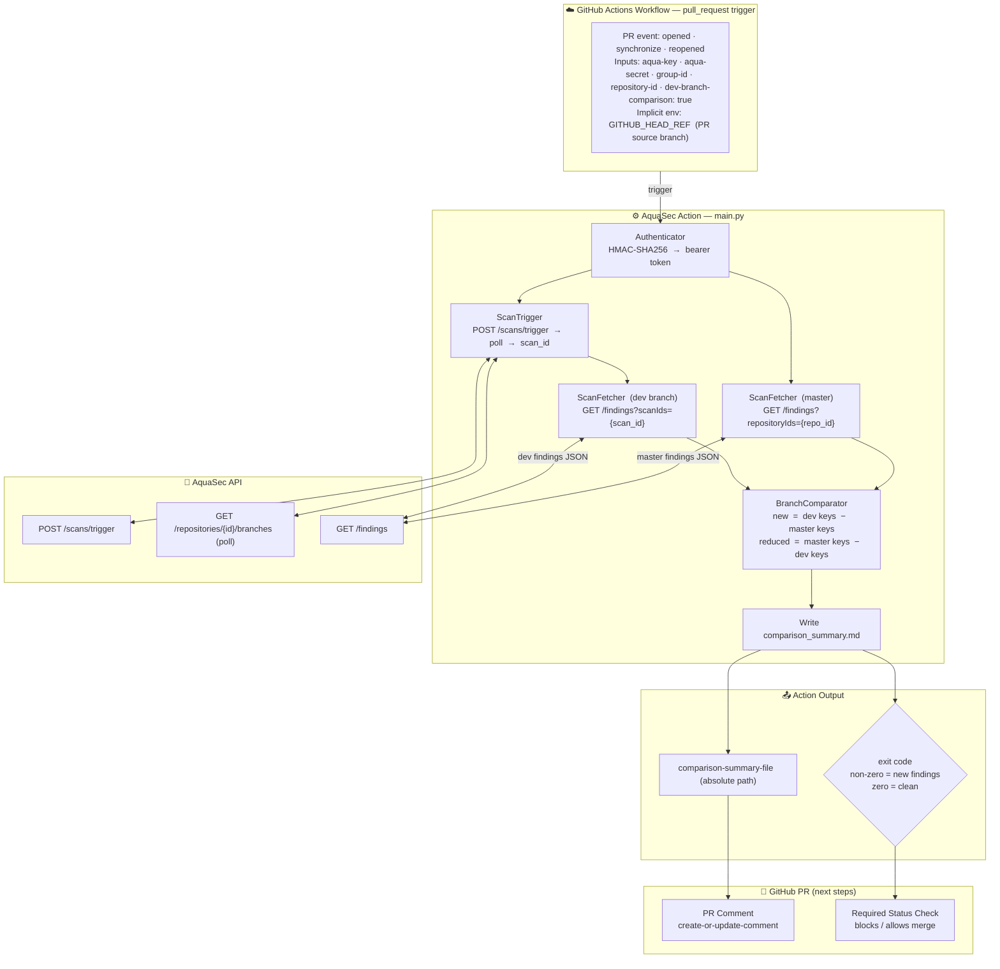

# Branch Comparison Mode

> An optional operational mode of the [AquaSec Scan Results](../README.md) action, enabled by
> setting `dev-branch-comparison: 'true'`.

---

## Table of Contents

- [Overview](#overview)
- [Flow](#flow)
- [Inputs](#inputs)
- [Output](#output)
- [Example Workflow](#example-workflow)
- [PR Comment Format](#pr-comment-format)
- [Failure Behaviour](#failure-behaviour)

---

## Overview

Branch Comparison Mode triggers a fresh AquaSec scan on the developer branch, fetches findings for
both the dev branch and master, computes the delta, and writes a Markdown summary. The summary is
surfaced as a step output so the caller workflow can post it as a PR comment.

Typical trigger: **pull request workflow** (`opened`, `synchronize`, `reopened`).

> **Prerequisite:** The workflow must run on a `pull_request` trigger so that the `GITHUB_HEAD_REF`
> environment variable is set to the PR source branch name.

---

## Flow



---

## Inputs

| Name | Description | Required | Default |
|------|-------------|----------|--------|
| `aqua-key` | AquaSec API Key credential | Yes | — |
| `aqua-secret` | AquaSec API Secret credential | Yes | — |
| `group-id` | AquaSec Group ID for authentication | Yes | — |
| `repository-id` | AquaSec Repository ID (UUID format) | Yes | — |
| `verbose-logging` | Enable detailed logging | No | `false` |
| `dev-branch-comparison` | Must be `true` to activate this mode | No | `false` |

| Implicit environment variable | Description |
|-------------------------------|-------------|
| `GITHUB_HEAD_REF` | PR source branch name — set automatically by GitHub on `pull_request` triggers |

> For details on obtaining `group-id` and `repository-id`, see the
> [Action Configuration](../README.md#action-configuration) section of the README.

---

## Output

| Name | Description | Example |
|------|-------------|--------|
| `comparison-summary-file` | Absolute path to the Markdown comparison summary | `/home/runner/work/repo/comparison_summary.md` |

> The file is written **before** the action fails, so steps guarded with `if: always()` can still
> read and post it even when new findings are detected.

---

## Example Workflow

Create a workflow file (e.g., `.github/workflows/aquasec-branch-comparison.yml`) to run on pull
requests:

```yaml
name: AquaSec Branch Comparison

on:
  pull_request:
    types: [ opened, synchronize, reopened ]

concurrency:
  group: aquasec-branch-comparison-${{ github.event.pull_request.number }}
  cancel-in-progress: true

permissions:
  contents: read
  pull-requests: write

jobs:
  branch-comparison:
    name: AquaSec Branch Comparison
    if: ${{ !github.event.pull_request.head.repo.fork }}
    runs-on: ubuntu-latest
    steps:
      - name: Checkout repository
        uses: actions/checkout@v6
        with:
          persist-credentials: false
          fetch-depth: 0

      - name: Compare branches
        id: aquasec
        uses: AbsaOSS/aquasec-scan-results@v0.2.0
        with:
          aqua-key: ${{ secrets.AQUA_KEY }}
          aqua-secret: ${{ secrets.AQUA_SECRET }}
          group-id: ${{ secrets.AQUA_GROUP_ID }}
          repository-id: ${{ secrets.AQUA_REPOSITORY_ID }}
          dev-branch-comparison: 'true'

      - name: Find existing PR comment
        if: always() && steps.aquasec.outputs.comparison-summary-file != ''
        uses: peter-evans/find-comment@v4
        id: find-comment
        with:
          issue-number: ${{ github.event.pull_request.number }}
          comment-author: 'github-actions[bot]'
          body-includes: '<!-- aquasec-branch-comparison -->'

      - name: Post or update PR comment
        if: always() && steps.aquasec.outputs.comparison-summary-file != ''
        uses: peter-evans/create-or-update-comment@v5
        with:
          issue-number: ${{ github.event.pull_request.number }}
          comment-id: ${{ steps.find-comment.outputs.comment-id }}
          edit-mode: replace
          body-path: ${{ steps.aquasec.outputs.comparison-summary-file }}
```

> **Note:** The `Compare branches` step **fails the workflow** when new security findings are
> detected in the developer branch. The PR comment steps use `if: always()` so the summary is
> always posted, even when the comparison step fails.

---

## PR Comment Format

The generated Markdown summary posted as a PR comment looks like this:

```markdown
<!-- aquasec-branch-comparison -->
## AquaSec Security Scan — Branch Comparison
Master compared with branch: feature/my-branch

|             | CRITICAL | HIGH | MEDIUM | LOW |
|-------------|:--------:|:----:|:------:|:---:|
| New (+)     |    1     |   2  |    0   |  3  |
| Reduced (-) |    0     |   1  |    1   |  0  |

### New Findings
...

### Reduced Findings
...
```

---

## Failure Behaviour

| Condition | Exit code | Workflow check | PR merge (branch protection) |
|-----------|:---------:|:--------------:|:-----------------------------:|
| New findings detected | `1` (non-zero) | Fails | Blocked |
| No new findings | `0` | Passes | Allowed |

When new findings are detected the action emits a `::error::` annotation visible in the workflow
log, then exits with code `1`. The comparison summary file is written before the failure so
subsequent steps using `if: always()` can still post it as a PR comment.