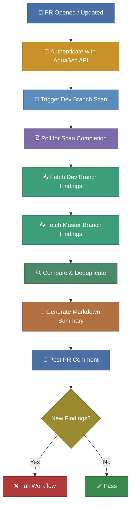

# Branch Comparison Mode

## Overview

Branch Comparison Mode provides **shift-left security feedback directly in your pull requests**.
Every time a PR is opened or updated, the action triggers a fresh AquaSec scan on the developer
branch, compares the results against the master branch baseline, and posts a severity breakdown
as a **PR comment**. Blocking the merge when new security findings are introduced.

> For setup instructions and workflow configuration, see the main [README](../README.md).

---

## How It Works

1. **PR Event Trigger** — The workflow runs automatically when a pull request is opened,
   synchronized (new commits pushed), or reopened.

2. **Authentication** — The action authenticates with the AquaSec API using HMAC-signed
   credentials to obtain a short-lived bearer token.

3. **Trigger Dev Branch Scan** — A fresh security scan is triggered on the PR's head branch
   via the AquaSec API.

4. **Poll for Completion** — The action polls the AquaSec API at a set interval until the
   scan completes, fails, or the timeout is exceeded.

5. **Fetch Findings** — Once the dev branch scan completes, the action fetches findings for
   both the **dev branch** (from the triggered scan) and the **master branch** (from the
   latest baseline scan).

6. **Compare & Deduplicate** — Findings unique to the dev branch are marked as **new**;
   findings that no longer appear are marked as **reduced**.

7. **Generate Summary** — A Markdown summary is generated with a severity breakdown table
   and detailed lists of new and reduced findings.

8. **Post PR Comment** — The summary is saved to a file and made available as an action
   output. A subsequent workflow step posts (or updates) the comment on the PR.

9. **Pass / Fail** — If any **new findings** are detected, the action fails. If no new
   findings exist, the workflow passes.

---

## Benefits

- **Shift-left security** — developers see security findings before code reaches master,
  not day later in a nightly report
- **Immediate PR feedback** — a severity breakdown table appears directly in the PR
  conversation, visible to reviewers and authors alike
- **Merge protection** — new vulnerabilities automatically block the PR, preventing
  regressions from being merged
- **Clear accountability** — each PR shows exactly which findings were introduced and
  which were resolved, making it easy to track who fixed what
> **⚠️ Exception: 3rd party vulnerability between scans** — a new finding may occasionally
> appear that was not introduced by the PR author. If a new CVE is published and matched to
> an existing dependency between the last master night scan and this branch scan, it will be
> flagged as a new finding even though the developer did not change that dependency.
- **No context switching** — developers stay in GitHub; no need to log in to the
  AquaSec platform

---

## Example PR Comment

Below is a realistic example of the summary comment posted on a pull request:

> ### AquaSec Security Scan — Branch Comparison
> 
> Master compared with branch: **feature/add-new-api**
>
> #### Severity Breakdown
>
> | | CRITICAL | HIGH | MEDIUM | LOW |
> |---|---|---|---|---|
> | **New (+)** | 0 | 1 | 2 | 0 |
> | **Reduced (-)** | 0 | 0 | 1 | 1 |
>
> #### New Findings
>
> - **[HIGH]** CVE-2026-4567 — SQL Injection in query builder (`src/db/query.py:42`)
> - **[MEDIUM]** CVE-2026-7890 — Insecure default TLS version (`src/net/client.py:18`)
> - **[MEDIUM]** CVE-2026-1122 — Missing input validation (`src/api/handler.py:105`)
>
> #### Reduced Findings
>
> - **[MEDIUM]** CVE-2025-3344 — Outdated cryptography library (`requirements.txt:8`)
> - **[LOW]** CVE-2025-9911 — Informational header disclosure (`src/server.py:31`)

---

## Failure Behaviour

The action guarantees that **the PR comment is always posted**, even when new findings cause the workflow to fail.
The summary is saved and the output is set before any failure is raised. Reviewers see the full analysis regardless
of the check result.

---

## Inputs & Outputs

### Action Inputs

| Input                   | Description                                  | Required |
|-------------------------|----------------------------------------------|----------|
| aqua-key                | AquaSec API Key credential                   | Yes      |
| aqua-secret             | AquaSec API Secret credential                | Yes      |
| group-id                | AquaSec Group ID for authentication          | Yes      |
| repository-id           | AquaSec Repository ID (UUID format)          | Yes      |
| dev-branch-comparison   | Must be set to 'true' to enable this mode    | Yes      |
| verbose-logging         | Enable detailed logging                      | No       |

### Output

| Output                    | Description                                      |
|---------------------------|--------------------------------------------------|
| comparison-summary-file   | Absolute path to the Markdown comparison summary |

---

## See Also

- [Night Scan Mode](night-scan-mode.md) — nightly security scans uploaded to the GitHub
  Security and quality tab
- [README — Full Setup Guide](../README.md) — workflow configuration, credentials, and examples
