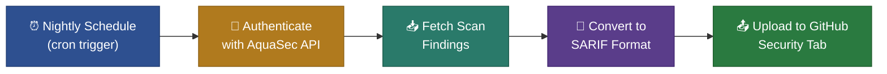

# Night Scan Mode

## Overview

Night Scan Mode provides **continuous, automated security monitoring** for your repository by **AquaSec**.
It is supposed to run on a nightly schedule (or any cron-based trigger), retrieves the latest security scan
findings from AquaSec, converts them to the industry-standard
[SARIF](https://sarifweb.azurewebsites.net/) format, and uploads them to
the **GitHub Security and quality tab**. This gives your team a daily security posture snapshot without
any manual effort.

> For setup instructions and workflow configuration, see the main [README](../README.md).

---

## How It Works

1. **Scheduled Trigger** — A GitHub Actions cron schedule triggers the workflow automatically
   (e.g., every night at 02:23 UTC). No developer action is required.

2. **Authentication** — The action authenticates with the AquaSec API using HMAC-signed
   credentials (AquaSec API key, secret, and group ID) to obtain a short-lived bearer token.

3. **Fetch Findings** — Using the repository ID, the action retrieves all security findings
   from the latest AquaSec scan. Results are fetched page by page to handle repositories
   with large numbers of findings.

4. **SARIF Conversion** — Each finding is mapped to a SARIF 2.1.0 rule and result, preserving
   severity levels (Critical, High, Medium, Low), affected file locations, remediation guidance,
   CWE references, and OWASP classifications.

5. **Upload to GitHub** — The generated SARIF file is uploaded to GitHub's Code Scanning feature,
   making findings visible directly in the **Security tab** of the repository.

---

## Benefits

- **Zero manual effort** — scans run on autopilot every night
- **Security tab integration** — findings appear alongside other code scanning alerts in GitHub
- **Standard format** — SARIF is supported by GitHub, VS Code, and many other tools, making it
  easy to integrate into existing security workflows
- **Rich finding details** — each alert includes all the important information that AquaSec provides
- **Historical tracking** — GitHub retains scan history, allowing teams to track security posture
  over time and measure improvement

---

## What You See in GitHub

After a successful Night Scan run, findings appear in **Security and quality → Code scanning alerts**.

#### Security Alert

>| Field                | Example Value                                              |
>|----------------------|------------------------------------------------------------|
>| **Title**            | axios: Server-Side Request Forgery via redirect handling   |
>| **Alert hash**       | c3d9ee12f1bb52a9e08977c3e5108900                           |
>| **Artifact**         | backend/package.json                                       |
>| **Type**             | vulnerabilities                                            |
>| **Vulnerability**    | CVE-2026-18234                                             |
>| **Severity**         | HIGH                                                       |
>| **Repository**       | my-org/my-repo                                             |
>| **Reachable**        | True                                                       |
>| **Scan date**        | 2026-04-09T02:24:10.000Z                                   |
>| **First seen**       | 2026-03-01T08:00:00.000Z                                   |
>| **SCM file**         | Link to the exact file and commit in GitHub                |
>| **Installed version**| 1.6.5                                                      |
>| **Start / End line** | 42 / 42                                                    |
>| **Message**          | Full description of the vulnerability                      |

#### Security Rule

Each alert is also associated with a security rule that describes **why** the finding was flagged.

>| Field            | Example Value                               |
>|------------------|---------------------------------------------|
>| **Rule ID**      | CVE-2026-18234                              |
>| **Category**     | Dependency Vulnerability                    |
>| **CWE**          | CWE-918: Server-Side Request Forgery        |
>| **OWASP**        | A10:2021 – Server-Side Request Forgery      |
>| **Remediation**  | Upgrade axios to version 1.7.0 or later     |
>| **References**   | Link to NVD advisory and upstream fix       |

---

## Inputs & Outputs

### Required Inputs

>| Input             | Description                         |
>|-------------------|-------------------------------------|
>| aqua-key          | AquaSec API Key credential          |
>| aqua-secret       | AquaSec API Secret credential       |
>| group-id          | AquaSec Group ID for authentication |
>| repository-id     | AquaSec Repository ID (UUID format) |

### Output

>| Output                   | Description                                |
>|--------------------------|--------------------------------------------|
>| nightscan-sarif-file     | Absolute path to the generated SARIF file  |

The SARIF file is then passed to the `github/codeql-action/upload-sarif` action for upload
to the Security and quality tab.

---

## See Also

- [Branch Comparison Mode](branch-comparison-mode.md) — PR-level security checks that compare
  findings between your branch and master
- [README — Full Setup Guide](../README.md) — workflow configuration, credentials, and examples
