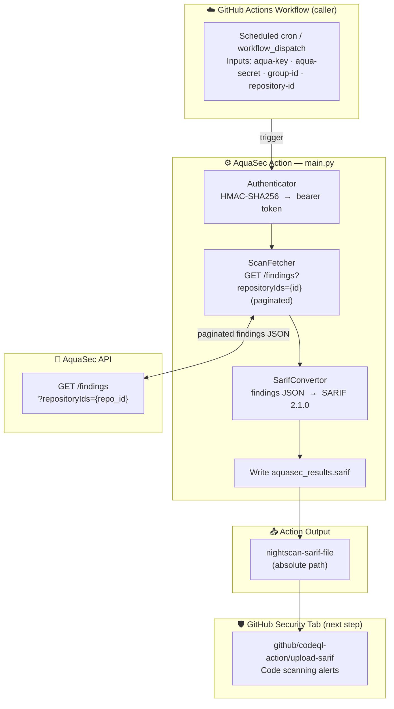

# Night Scan Mode

> The default operational mode of the [AquaSec Scan Results](../README.md) action.

---

## Table of Contents

- [Overview](#overview)
- [Flow](#flow)
- [Inputs](#inputs)
- [Output](#output)
- [Example Workflow](#example-workflow)
- [GitHub Security Tab Integration](#github-security-tab-integration)

---

## Overview

Night Scan Mode retrieves all security scan findings for a repository from the AquaSec API, converts
them to [SARIF 2.1.0](https://docs.oasis-open.org/sarif/sarif/v2.1.0/sarif-v2.1.0.html) format, and
writes the result to a file. The file path is surfaced as a step output so the caller workflow can
upload it directly to GitHub's Code Scanning feature (Security tab).

Typical trigger: **nightly scheduled workflow**.

---

## Flow



---

## Inputs

| Name | Description | Required | Default |
|------|-------------|----------|--------|
| `aqua-key` | AquaSec API Key credential | Yes | — |
| `aqua-secret` | AquaSec API Secret credential | Yes | — |
| `group-id` | AquaSec Group ID for authentication | Yes | — |
| `repository-id` | AquaSec Repository ID (UUID format) | Yes | — |
| `verbose-logging` | Enable detailed logging | No | `false` |
| `dev-branch-comparison` | Must be `false` (or omitted) for this mode | No | `false` |

> For details on obtaining `group-id` and `repository-id`, see the
> [Action Configuration](../README.md#action-configuration) section of the README.

---

## Output

| Name | Description | Example |
|------|-------------|--------|
| `nightscan-sarif-file` | Absolute path to the generated SARIF file | `/home/runner/work/repo/aquasec_results.sarif` |

---

## Example Workflow

Create a workflow file (e.g., `.github/workflows/aquasec-night-scan.yml`) to run on a nightly
schedule:

```yaml
name: AquaSec Night Scan

on:
  schedule:
    - cron: '23 2 * * *'  # Runs at 02:23 UTC daily (modify as needed)
  workflow_dispatch:

concurrency:
  group: aquasec-security-night-scan-${{ github.ref }}
  cancel-in-progress: true

permissions:
  contents: read
  security-events: write

jobs:
  aquasec-night-scan:
    runs-on: ubuntu-latest
    steps:
      - name: Checkout Code
        uses: actions/checkout@v6
        with:
          persist-credentials: false
          fetch-depth: 0

      - name: Set up Python
        uses: actions/setup-python@v6
        with:
          python-version: '3.14'

      - name: Fetch AquaSec Scan Results
        id: aquasec
        uses: AbsaOSS/aquasec-scan-results@v0.2.0
        with:
          aqua-key: ${{ secrets.AQUA_KEY }}
          aqua-secret: ${{ secrets.AQUA_SECRET }}
          group-id: ${{ secrets.AQUA_GROUP_ID }}
          repository-id: ${{ secrets.AQUA_REPOSITORY_ID }}
          verbose-logging: 'false'

      - name: Upload Scan Results to GitHub Security
        uses: github/codeql-action/upload-sarif@v3
        with:
          sarif_file: ${{ steps.aquasec.outputs.nightscan-sarif-file }}
          category: aquasec
```

---

## GitHub Security Tab Integration

After the SARIF file is uploaded with `github/codeql-action/upload-sarif`, findings appear under:

**Repository → Security → Code scanning alerts**

Each alert displays:

- Severity level
- Rule ID
- File location
- Remediation guidance