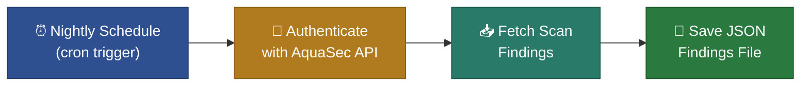

# Night Scan Mode

## Overview

Night Scan Mode provides **continuous, automated security monitoring** for your repository by **AquaSec**.
It is supposed to run on a nightly schedule (or any cron-based trigger), retrieves the latest security scan
findings from AquaSec, and saves them as a JSON file. This raw findings data can then be consumed by
downstream actions for further processing (e.g., issue creation, notifications).

> For setup instructions and workflow configuration, see the main [README](../README.md).

---

## How It Works

1. **Scheduled Trigger** — A GitHub Actions cron schedule triggers the workflow automatically
   (e.g., every night at 02:23 UTC). No developer action is required.

2. **Authentication** — The action authenticates with the AquaSec API using HMAC-signed
   credentials (AquaSec API key, secret, and group ID) to obtain a short-lived bearer token.

3. **Fetch Findings** — Using the repository ID, the action retrieves all security findings
   from the latest AquaSec scan. Results are fetched page by page to handle repositories
   with large numbers of findings.

4. **Save JSON File** — The raw findings response is saved as a JSON file, making it available
   as an output for downstream workflow steps.

---

## Benefits

- **Zero manual effort** — scans run on autopilot every night
- **Raw data output** — full AquaSec findings in JSON format for flexible downstream processing
- **Decoupled architecture** — separate actions can convert, filter, or route findings as needed
- **Historical tracking** — JSON artifacts can be stored for trend analysis

---

## Inputs & Outputs

### Action Inputs

| Input             | Description                         | Required |
|-------------------|-------------------------------------|----------|
| aqua-key          | AquaSec API Key credential          | Yes      |
| aqua-secret       | AquaSec API Secret credential       | Yes      |
| group-id          | AquaSec Group ID for authentication | Yes      |
| repository-id     | AquaSec Repository ID (UUID format) | Yes      |
| verbose-logging   | Enable detailed logging             | No       |

### Output

| Output              | Description                                       |
|---------------------|---------------------------------------------------|
| nightscan-json-file | Absolute path to the generated JSON findings file |

The JSON file contains the raw AquaSec scan response and can be passed to downstream actions
for further processing.

---

## See Also

- [Branch Comparison Mode](branch-comparison-mode.md) — PR-level security checks that compare
  findings between your branch and master
- [README — Full Setup Guide](../README.md) — workflow configuration, credentials, and examples
